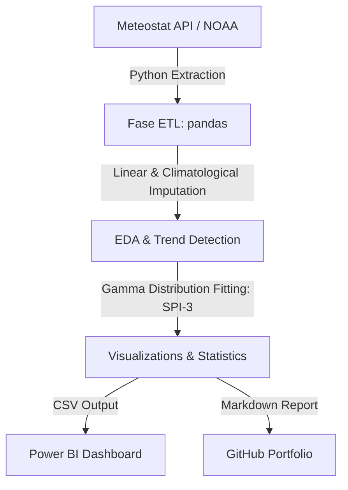

# Neiva Climate & Irrigation Analysis (1990 - 2026)

[](https://www.python.org/)
[](https://meteostat.net/)

Data pipeline and climatological analysis of **Neiva, Colombia**. This project implements statistical trend tests (Mann-Kendall) and the Standardized Precipitation Index (SPI-3) to optimize agricultural irrigation planning and analyze climate change trends in the department of Huila.

---

## 📌 Business Case & Objectives

Neiva is located in a critical agricultural region of Colombia, producing crops like rice, cocoa, and fruits that depend heavily on irrigation. Climate variability (such as El Niño and La Niña) creates extreme challenges for water resource management.

This project aims to:
1.  **Extract & Clean:** Build an automated ETL pipeline to retrieve historical weather records from NOAA's station at the Benito Salas Airport (WMO: 80315).
2.  **Evaluate Climate Trends:** Determine if temperature and rainfall have statistically significant trends over the last 36 years.
3.  **Model Droughts:** Calculate the **SPI-3 (Standardized Precipitation Index)** to isolate and evaluate agricultural drought periods.
4.  **Actionable Insights:** Define crop planting recommendations and critical irrigation windows.
5.  **Dashboard Integration:** Export clean data for visualization in Power BI.

---

## ⚙️ Architecture & Pipeline



---

## 📊 Key Climatological Insights

### 1. Temperature Trends: Night Warming
Running the **Mann-Kendall trend test** on annual aggregates from 1990 to 2025 revealed:
*   **Mean & Max Temperatures:** No statistically significant trend ($p > 0.05$).
*   **Minimum Temperature:** **A statistically significant increasing trend ($p = 0.0246$)** of **$+0.148 ^\circ\text{C}$ per decade**.

> [!IMPORTANT]
> Nighttime temperatures are rising faster than daytime temperatures. In crops like rice, warmer nights increase respiration rates, causing plants to expend more energy at night and reducing overall crop yield.

### 2. Precipitation Trends: Rising Totals
*   **Precipitation Trend:** **A highly significant increasing trend ($p = 0.0031$)** of **$+242.3\text{ mm}$ per decade**.
*   While Neiva is getting more cumulative rain per year, the rain is concentrated in specific months, leaving dry seasons vulnerable to evaporation from rising temperatures.

### 3. Seasonality & The Bimodal Calendar
Neiva exhibits a classic bimodal rainfall regime:
*   **Wet Seasons:** March - April and October - November (highest peak in November: average **124.7 mm**).
*   **Dry Seasons:** Enero - Febrero and a major dry season in **July - September**.
*   **Critical Irrigation Window:** **August** is the driest month (average **7.2 mm** of rain) and has an average maximum temperature of **35.1 °C** with high wind speeds of **10.7 km/h**. Crops require 100% artificial irrigation during this quarter.

### 4. Historic Drought Analysis (SPI-3)
Our SPI-3 model successfully isolated the worst agricultural droughts in Neiva's recent history:
*   **1992 (SPI = -1.89):** Severe drought corresponding to the historic 1991-1992 El Niño event.
*   **2009-2010 (SPI = -1.91):** Extreme drought associated with the 2009 El Niño.

---

## 📂 Repository Structure

```text
├── data/
│   ├── neiva_clima_diario.csv        # Clean daily time series (13,300 records)
│   ├── neiva_clima_mensual.csv       # Clean monthly aggregates (437 records)
│   └── neiva_clima_analisis_final.csv# Final enriched dataset with SPI-3 for Power BI
│
├── plots/
│   ├── temperatura_tendencia.png     # Temperature trends plot
│   ├── precipitacion_estacionalidad.png # Rainfall seasonality boxplot
│   └── spi_sequias.png               # SPI-3 drought time series
│
├── requirements.txt                  # Python dependencies
├── data_extraction.py                # ETL and Imputation script
├── data_analysis.py                  # Statistical testing and SPI modeling script
└── README.md                         # Portfolio Case Study (this file)
```

---

## 🚀 How to Run the Project

### 1. Setup Environment
```bash
python -m venv venv
# On Windows (PowerShell):
.\venv\Scripts\Activate.ps1
# On Linux/macOS:
source venv/bin/activate
```

### 2. Install Dependencies
```bash
pip install -r requirements.txt
```

### 3. Run Pipeline
*   **Step 1: Extract and Clean Data**
    ```bash
    python data_extraction.py
    ```
*   **Step 2: Run Statistical Analysis and SPI Calculation**
    ```bash
    python data_analysis.py
    ```

---

## 🔌 Power BI Integration

The final dataset `neiva_clima_analisis_final.csv` is fully structured for Power BI. 
We suggest creating a conditional column based on the `spi_3` value to classify drought severity:
*   `SPI-3 <= -2.0` $\rightarrow$ **Extreme Drought** (Dark Red)
*   `-2.0 < SPI-3 <= -1.5` $\rightarrow$ **Severe Drought** (Red)
*   `-1.5 < SPI-3 <= -1.0` $\rightarrow$ **Moderate Drought** (Orange)
*   `SPI-3 > -1.0` $\rightarrow$ **Normal/Wet Condition** (Green/Gray)
