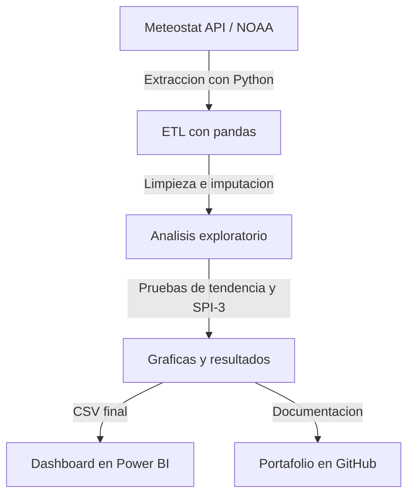

# Analisis de clima y riego en Neiva (1990 - 2026)

[](https://www.python.org/)
[](https://meteostat.net/)

Proyecto de analisis de datos climaticos para **Neiva, Colombia**. El repositorio construye un flujo ETL con Python, limpia registros historicos de clima, calcula indicadores de sequia agricola y genera visualizaciones listas para un caso de portafolio.

El caso se enfoca en una pregunta practica: **como puede usarse la informacion climatica historica para apoyar decisiones de riego agricola en Neiva?**

---

## Caso de negocio y objetivos

Neiva esta ubicada en una zona agricola importante del Huila, con cultivos como arroz, cacao y frutales que dependen del manejo oportuno del agua. La variabilidad climatica, incluyendo fenomenos como El Nino y La Nina, crea riesgos para la planeacion del riego, la productividad y el uso eficiente de los recursos hidricos.

Este proyecto busca:

1. **Extraer y limpiar datos climaticos:** construir un flujo ETL automatizado para obtener registros historicos de la estacion del Aeropuerto Benito Salas (WMO: 80315).
2. **Evaluar tendencias climaticas:** identificar si la temperatura y la precipitacion presentan cambios estadisticamente significativos en el tiempo.
3. **Modelar sequias agricolas:** calcular el **SPI-3**, o Indice de Precipitacion Estandarizado a 3 meses, para detectar periodos secos relevantes para agricultura.
4. **Generar recomendaciones accionables:** identificar meses criticos para riego y ventanas utiles para la planeacion agricola.
5. **Preparar datos para visualizacion:** exportar archivos limpios que pueden usarse en Power BI u otras herramientas de analisis.

---

## Flujo de trabajo del proyecto



---

## Hallazgos principales

### 1. Tendencias de temperatura: calentamiento nocturno

Al aplicar la prueba de tendencia de Mann-Kendall sobre los datos anuales de 1990 a 2025, se encontro:

* **Temperatura media y maxima:** no presentan una tendencia estadisticamente significativa.
* **Temperatura minima:** presenta una tendencia creciente estadisticamente significativa, con un cambio aproximado de **+0.148 grados Celsius por decada**.

Este resultado es importante porque las temperaturas nocturnas mas altas pueden afectar cultivos sensibles. En el caso del arroz, noches mas calidas pueden aumentar la respiracion de la planta y reducir energia disponible para el rendimiento final del grano.

### 2. Tendencias de precipitacion: aumento del acumulado anual

La precipitacion anual muestra una tendencia creciente significativa, cercana a **+242.3 mm por decada**. Sin embargo, recibir mas lluvia total durante el ano no significa que el riesgo agricola desaparezca, porque la lluvia puede concentrarse en meses especificos y dejar periodos secos con mayor demanda de riego.

### 3. Estacionalidad: regimen bimodal de lluvias

Neiva presenta un comportamiento bimodal:

* **Temporadas de lluvia:** marzo-abril y octubre-noviembre.
* **Temporadas secas:** enero-febrero y, especialmente, julio-septiembre.
* **Mes mas critico para riego:** agosto, por combinar baja precipitacion, temperaturas altas y mayor presion de evapotranspiracion.

### 4. Analisis historico de sequias con SPI-3

El indicador SPI-3 permite identificar periodos de sequia agricola. Dentro de los eventos mas fuertes aparecen:

* **1992:** sequia severa asociada al fenomeno de El Nino de 1991-1992.
* **2009-2010:** sequia extrema asociada al fenomeno de El Nino de 2009.

---

## Estructura del repositorio

```text
data/
  neiva_clima_diario.csv           # Serie diaria limpia
  neiva_clima_mensual.csv          # Agregaciones mensuales
  neiva_clima_analisis_final.csv   # Dataset final con SPI-3

plots/
  temperatura_tendencia.png        # Grafica de tendencias de temperatura
  precipitacion_estacionalidad.png # Grafica de estacionalidad de lluvias
  spi_sequias.png                  # Serie temporal de sequias SPI-3

requirements.txt                   # Dependencias del proyecto
data_extraction.py                 # Extraccion y limpieza de datos
data_analysis.py                   # Analisis estadistico y visualizaciones
README.md                          # Documentacion del caso
```

---

## Como ejecutar el proyecto

### 1. Crear y activar el entorno virtual

```bash
python -m venv venv
```

En Windows PowerShell:

```bash
.\venv\Scripts\Activate.ps1
```

En Linux o macOS:

```bash
source venv/bin/activate
```

### 2. Instalar dependencias

```bash
pip install -r requirements.txt
```

### 3. Ejecutar el flujo completo

Primero se descargan y limpian los datos:

```bash
python data_extraction.py
```

Luego se ejecuta el analisis estadistico, el calculo de SPI-3 y la generacion de graficas:

```bash
python data_analysis.py
```

---

## Integracion con Power BI

El archivo `neiva_clima_analisis_final.csv` queda listo para importarse en Power BI. Una columna condicional basada en `spi_3` puede clasificar la severidad de las sequias:

* `SPI-3 <= -2.0`: sequia extrema
* `-2.0 < SPI-3 <= -1.5`: sequia severa
* `-1.5 < SPI-3 <= -1.0`: sequia moderada
* `SPI-3 > -1.0`: condicion normal o humeda

---

## Tecnologias utilizadas

* Python
* pandas y NumPy
* Matplotlib y Seaborn
* Meteostat
* SciPy
* pymannkendall
* Power BI
